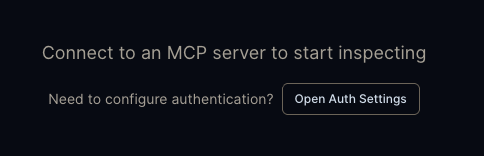

# MCP Inspector Guide

MCP Inspector is an interactive debugging tool for MCP servers. It lets you browse tools, call them, and inspect the raw JSON-RPC messages -- useful for understanding how the protocol works before connecting Claude AI.

## Getting Started

Run the inspector (no install needed):

```bash
npx @modelcontextprotocol/inspector
```

This opens a web UI (usually at `http://localhost:6274`).

## Connecting to Sketchpad

The Inspector offers two connection modes: **direct** (browser talks to the server) and **proxy** (Inspector backend relays requests). Use **proxy mode** -- Sketchpad doesn't serve CORS headers (by design, since Claude AI doesn't need them), so direct browser requests get blocked by the browser's CORS preflight before they even reach the server.

Add the Inspector origin to `ALLOWED_ORIGINS` in your `.env` so the server's origin allowlist accepts proxied requests:

```
ALLOWED_ORIGINS=https://claude.ai,https://www.claude.ai,http://localhost:6274
```

Then in the Inspector UI:

1. Set:
   - **Transport Type:** Streamable HTTP
   - **URL:** `https://sketchpad.kempenich.dev/mcp`
   - **Connection mode:** Proxy
2. Before connecting, click **Open Auth Settings** to configure OAuth:

   

   Enter the OAuth credentials (Client ID, etc.) and complete the GitHub login flow.
3. Click **Connect**

## Fun Things to Try

### 1. Browse the Tools

After connecting, go to the **Tools** tab. You should see two tools:

- **read_file** -- no arguments, returns the sketchpad contents
- **write_file** -- takes `content` (string) and optional `mode` ("replace" or "append")

Look at the tool descriptions -- they tell Claude AI what the tools are for and how to use them.

### 2. Read the Welcome Message

Call `read_file` with no arguments. If the sketchpad file does not exist yet, you will see the welcome message:

> Welcome to Sketchpad! Write something here.

### 3. Write Something

Call `write_file` with:
- `content`: `"# My First Note\n\nHello from MCP Inspector!"`

The response confirms the write and shows the file size.

### 4. Read It Back

Call `read_file` again. Your text should appear exactly as you wrote it.

### 5. Try Append Mode

Call `write_file` with:
- `content`: `"\n\n## Added Later\n\nThis was appended."`
- `mode`: `"append"`

Then `read_file` to see both sections together.

### 6. Check the OAuth Endpoints

Open a new browser tab and visit these URLs directly (replace the host if using a tunnel):

- `http://localhost:8000/.well-known/oauth-authorization-server` -- the OAuth server metadata (RFC 8414)
- `http://localhost:8000/.well-known/oauth-protected-resource` -- the protected resource metadata (RFC 9728)

These are the discovery endpoints that Claude AI uses to figure out how to authenticate.

### 7. Watch the Raw Messages

The Inspector shows the raw JSON-RPC messages in the **Messages** or **History** tab. Look for:
- `initialize` -- the handshake that starts every MCP session
- `tools/list` -- how the client discovers available tools
- `tools/call` -- the actual tool invocation with arguments and response

This is exactly what Claude AI sends and receives when using your server.

## Tips

- If you get a 401 error, the OAuth token may have expired. Reconnect and re-authenticate.
- The Inspector stores its OAuth tokens in the browser session. Clearing cookies will require re-authentication.
- If the server is behind a cloudflared tunnel, use the tunnel URL (e.g., `https://random-words.trycloudflare.com/mcp`) instead of localhost.
